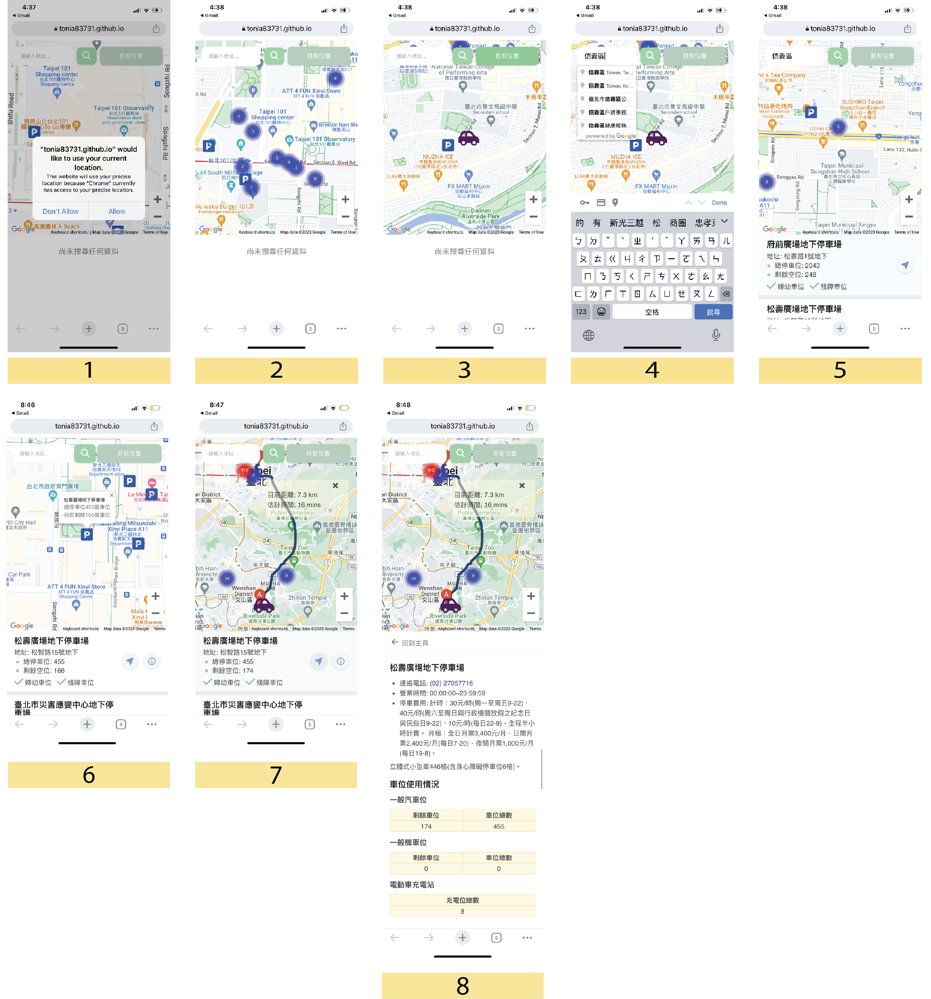

# Taipei Parking Lots

User are able to find parking lots near their current location. They could also scroll the map to find parking lots in other area in Taipei.
This project was bootstrapped with [Create React App](https://github.com/facebook/create-react-app).

## Introduction

This project is available on both mobile and desktop.

* The app could show user's current location
* The app could show available parking lots near user's location
* The app could show available parking lots in Taipei city
  * Parking lot information include name and address
  * Parking lot information show if the parking lot still have availabe space
  * Parking lot informatio show whether the parking lot have parking spot for Disabled and Pragnancy individual
  * User could click on information icon to see detail information about the parking lot (include telephone number, service time, pay price and car, motor, chargin station number)
  * User could click on arrow icon to see direction from user current location to the parking lot

## Demo Page Link

https://tonia83731.github.io/taipei-parking/

## Demo Feature (Mobile)
(Number description same as Demo Feature (Desktop))


## Demo Feature (Desktop)

1. When first landing Remind user to turn on map navigation in order to get current location while click on "目前位置"
2. The user first center location will be Center Taipei and the Parking lot around
3. User Could click on "P" icon to get the parking lot name and available spot
4. When click on "目前位置", the map will guild you to your current location with a "Car" icon
5. Input parking lot name or region to get the list of parking lot, the map will also center the position
6. The list will show parking lot name, address, total spot, available spot, and pregnancy/disable avilable
7. Click on arrow icon will show the direction, distance, duration from user current location to the parking lot
8. Click on info icon will show the detail information about the parking lot include tel, open time , cost, description, car parking number, motor parking number and charging station



## Develp Environment and Tools

* node.js @14.18.1
* react @18.2.0
* react-router-dom @6.14.0
* axios @0.27.2
* sass @1.63.6
* @react-google-maps/api @2.18.1
* @googlemaps/markerclusterer @2.3.1
* twd97-to-latlng @1.0.0

## Getting Start

1. Clone the project to local, enter:

```
git clone https://github.com/tonia83731/taipei-parking.git
```

2. Go into the project(cd), later enter to install npm:

```
npm install
```

3. Start the project by enter:

```
npm start
```

4. If you wish to end the project, enter:

```
ctrl + c
```

## For Future Development

This is for future development, will not include in current project

* Maybe will include other city parking lot information future

